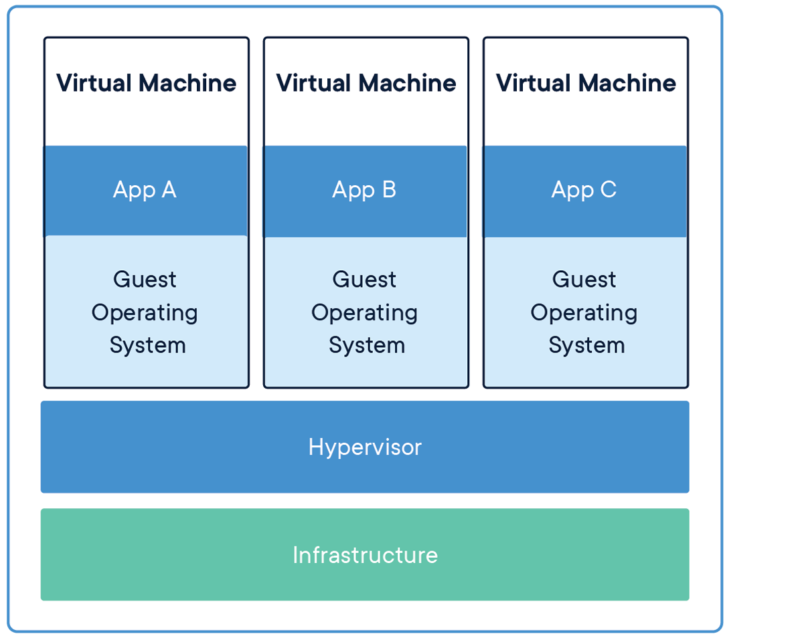

# Docker y Kubernetes 101: Un vistaso teórico sobre estas dos herramientas desde cero.

## Microservicios

### ¿Qué son los microservicios?

Los microservicios son una arquitectura de software que se basa en la creación de servicios independientes que se comunican entre sí a través de una red. Cada uno de estos servicios se encarga de una tarea específica y se pueden desarrollar, desplegar y escalar de forma independiente.

### Ventajas de los microservicios

- *Escalabilidad*: Cada servicio puede ser escalado de forma independiente.
- *Despliegue continuo*: Cada servicio puede ser desplegado de forma independiente.
- *Facilidad de mantenimiento*: Cada servicio puede ser actualizado de forma independiente.
- *Facilidad de desarrollo*: Cada servicio puede ser desarrollado de forma independiente.
- *Resistencia a fallos*: Si un servicio falla, los demás pueden seguir funcionando.
- *Facilidad de adopción de nuevas tecnologías*: Cada servicio puede ser desarrollado con la tecnología que mejor se adapte a sus necesidades.

### Desventajas de los microservicios

- *Complejidad*: La arquitectura de microservicios es más compleja que la arquitectura monolítica.
- *Latencia*: La comunicación entre servicios puede introducir latencia en la aplicación.
- *Consistencia*: Mantener la consistencia de los datos entre servicios puede ser complicado.
- *Seguridad*: La seguridad de los microservicios puede ser más complicada que la de una aplicación monolítica.

## Contenedores

### ¿Qué son los contenedores?

Los contenedores son una forma de empaquetar aplicaciones y sus dependencias en un entorno aislado. Cada contenedor se ejecuta en un entorno aislado y no comparte recursos con otros contenedores.

### Ventajas de los contenedores

- *Portabilidad*: Los contenedores se pueden ejecutar en cualquier entorno que soporte contenedores.
- *Escalabilidad*: Los contenedores se pueden escalar de forma independiente.
- *Despliegue continuo*: Los contenedores se pueden desplegar de forma independiente.
- *Facilidad de mantenimiento*: Los contenedores se pueden actualizar de forma independiente.
- *Facilidad de desarrollo*: Los contenedores se pueden desarrollar de forma independiente.
- *Aislamiento*: Los contenedores se ejecutan en un entorno aislado.

### Desventajas de los contenedores

- *Complejidad*: Los contenedores pueden introducir complejidad en la infraestructura.
- *Seguridad*: Los contenedores pueden introducir problemas de seguridad si no se configuran correctamente.
- *Rendimiento*: Los contenedores pueden introducir latencia en la aplicación.

## Contenedores vs. Máquinas virtuales

### ¿Cuál es la diferencia entre contenedores y máquinas virtuales?

Los contenedores y las máquinas virtuales son dos tecnologías que permiten ejecutar aplicaciones en entornos aislados, pero hay algunas diferencias importantes entre ellas.

- *Aislamiento*: Los contenedores comparten el mismo kernel del sistema operativo, mientras que las máquinas virtuales tienen su propio kernel.
- *Rendimiento*: Los contenedores tienen un rendimiento mejor que las máquinas virtuales, ya que no tienen la sobrecarga de un sistema operativo completo.
- *Portabilidad*: Los contenedores son más portables que las máquinas virtuales, ya que se pueden ejecutar en cualquier entorno que soporte contenedores.
- *Escalabilidad*: Los contenedores son más escalables que las máquinas virtuales, ya que se pueden escalar de forma independiente.
- *Despliegue continuo*: Los contenedores se pueden desplegar de forma más rápida que las máquinas virtuales, ya que no requieren un reinicio del sistema operativo.

 
(docker.com)

## Contenedores y microservicios

### ¿Cómo se relacionan los contenedores y los microservicios?

Los contenedores y los microservicios son dos tecnologías que se complementan entre sí. Los contenedores permiten empaquetar aplicaciones y sus dependencias en un entorno aislado, lo que facilita el desarrollo, despliegue y escalabilidad de los microservicios.

Los microservicios se pueden empaquetar en contenedores y desplegar en un entorno de contenedores, lo que permite escalar y mantener los microservicios de forma independiente.

Muchas veces estos dos conceptos se confunden, pero es importante entender que son dos tecnologías diferentes que se complementan entre sí.

[Docker](docker.md) | [Kubernetes](kubernetes.md)

